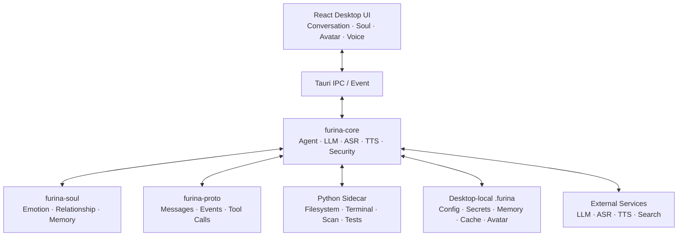

# Furina Desktop

> 一个拥有稳定人格、长期记忆、情绪连续性与关系成长能力的桌面 AI 生命体。

 [](https://v2.tauri.app/) [](desktop/ui) [](crates/furina-core)

Furina Desktop 是 Furina Personal AI Lifeform 的独立桌面实现。她不只是普通聊天窗口：本地 Runtime 维护人格、情绪、关系和记忆，大语言模型负责生成语言，工具系统负责执行任务，权限网关负责守住边界。

项目原则：**人格是灵魂，Runtime 是大脑，工具是双手，安全是边界，验证是生命线。**

历史 Furina Agent CLI 已冻结在 [nanbuye-png/furina-agent](https://github.com/nanbuye-png/furina-agent) 的 Tag/Release 中；本仓库自 v0.1.1 起是唯一后续开发主线。Desktop v0.1.2 已完成功能验收，当前进入 **Desktop v0.1.4 Persona v2.0 开发阶段**，不读取或共享 CLI 的本地历史数据。

## 目录

- [当前状态](#当前状态)
- [项目定位](#项目定位)
- [主要能力](#主要能力)
- [架构](#架构)
- [项目结构](#项目结构)
- [发布版使用](#发布版使用)
- [快速开始](#快速开始)
- [使用说明](#使用说明)
- [配置](#配置)
- [本地数据与隐私](#本地数据与隐私)
- [安全边界](#安全边界)
- [开发与测试](#开发与测试)
- [文档导航](#文档导航)
- [已知限制](#已知限制)
- [路线图](#路线图)
- [版权与免责声明](#版权与免责声明)

## 当前状态

| 项目 | 状态 |
| --- | --- |
| 当前版本 | **Desktop v0.1.4 Persona v2.0（开发中）** |
| 开发主线 | 本仓库 `main` |
| 桌面框架 | Tauri 2 |
| 前端 | React 18 + Vite 5 |
| 3D Avatar | Three.js + `@pixiv/three-vrm` |
| 后端核心 | Rust workspace |
| 工具侧车 | Python 3.11+ |
| 文本对话 / ASR / TTS | 已验证 |
| Desktop 独立启动 | 已验证 |
| CLI 数据共享 | **不共享** |

v0.1.4 的当前重点是稳定人格底色、持续情绪、上下文自然变化与 Agent 零主动错误边界。普通交流倾向简洁，但会根据问题复杂度自然展开；舞台语气仅在明确表演请求或特殊角色话题中启用。

2026-08-11 分离验收结果：Rust 156 项测试通过、Python 28 项测试通过、React/Vite 生产构建通过，并在删除本地 CLI 目录后完成 Desktop 独立启动检查。

## 项目定位

- **不是**：历史 CLI/TUI 的包装层、普通聊天机器人、单纯的模型客户端。
- **是**：长期陪伴型 Personal AI Lifeform 的桌面载体。
- **核心目标**：稳定人格、记忆连续性、情绪一致性、关系成长与自然语音交互。
- **扩展能力**：在用户审批下读取项目、修改文件、运行命令、执行测试、联网检索和处理图片。
- **模型可替换**：人格与长期状态由本地 Runtime 管理，不绑定单一 LLM 提供方。

## 主要能力

### 桌面对话

- React 对话工作区与 Tauri IPC。
- 流式文本渲染和中间状态展示。
- 新消息可打断尚未播放完的 TTS。
- 工具执行前显示审批弹窗，同意或拒绝会回传 Rust Core。

### 语音交互

- **ASR**：按住麦克风按钮录音，松开后转写并发送。
- **TTS**：可开启或关闭自动朗读，并在界面调整语速。
- **fish.audio**：默认真实朗读引擎，支持公开音色包。
- **Qwen Omni**：用于 ASR；TTS 路径保留为实验选项。
- 音频缓存只写入 Desktop 自己的 `.furina/voice`。

### Soul Engine

- 六维连续情绪状态与心情派生。
- 五阶段关系成长。
- 情景、语义和目标等长期记忆及重要性评分。
- 价值观、行为意图、主动触发和动态人格上下文。
- 记忆与关系持久化到 Desktop 自己的 `.furina/memory`。

### 3D Avatar

- Three.js + VRM Avatar 舞台。
- 从 `.furina/avatar/Furina.vrm` 加载本地模型。
- Avatar expression / intent 与具体渲染实现解耦。
- 支持后续口型同步、动作系统和表达策略扩展。

### Agent Runtime

- Rust 状态机和上下文压缩。
- Python JSON-RPC sidecar 工具进程。
- 文件、终端、扫描、测试报告等工具。
- 危险命令检测、工作区越界检测和私有目录保护。
- 工具结果验证、失败修复循环和外部修改检测。

### 模型、视觉与联网

- 多个 OpenAI 兼容模型提供方配置。
- 图片识别预处理代理。
- DuckDuckGo、Sogou、Tavily、Bing、SearXNG 等搜索后端。
- Desktop 本地网页缓存与检索。

## 架构



### 责任边界

| 层 | 责任 |
| --- | --- |
| React UI | 展示、输入、录音、音频播放、审批交互、Avatar 渲染 |
| Tauri | IPC 命令、事件转发、Desktop 生命周期 |
| `furina-core` | Agent、LLM、语音、视觉、联网、权限和 sidecar 装配 |
| `furina-soul` | 人格状态、情绪、关系、记忆与主动行为 |
| `furina-proto` | Rust Core、sidecar 和 UI 之间的稳定协议 |
| Python sidecar | 受工作区和审批边界约束的本机工具执行 |

## 项目结构

```text
Furina_Desktop/
├── .furina/
│   ├── config.yaml              # Desktop 配置
│   ├── secrets.env.example      # 密钥模板
│   ├── secrets.env              # 本地密钥，Git 忽略
│   ├── memory/                  # Desktop 独立记忆，Git 忽略
│   ├── voice/                   # TTS 缓存，Git 忽略
│   ├── web_cache/               # 网页缓存，Git 忽略
│   └── avatar/Furina.vrm        # 本地 Avatar，Git 忽略
├── crates/
│   ├── furina-core/
│   ├── furina-proto/
│   └── furina-soul/
├── desktop/
│   ├── resources/               # 安装/便携默认资源
│   ├── src-tauri/               # Tauri 后端与 NSIS 配置
│   └── ui/                      # React + Vite 前端
├── docs/                        # 架构、启动、语音和 Avatar 文档
├── persona/                     # 人格配置与系统提示词
├── python/furina_tools/         # Python sidecar
├── scripts/                     # sidecar 与便携包构建脚本
├── tests/                       # fixtures 与黄金场景
├── Cargo.toml
└── Cargo.lock
```

## 发布版使用

v0.1.2 RC1 面向 Windows x64，当前本地候选构建提供两类未签名产物：

- `Furina-Desktop-0.1.2-x64-Setup.exe`：NSIS 当前用户安装器，运行数据写入应用专属 AppData；卸载默认保留配置、密钥和记忆。
- `Furina-Desktop-0.1.2-x64-Portable.zip`：解压后直接运行，`portable.flag` 使数据写入同目录的 `data`。

首次启动会依次完成旧 Desktop 数据检测、LLM 配置、可选语音配置、可选 VRM 导入和诊断。项目与候选包均不包含用户 VRM、API Key、记忆或缓存。未签名版本可能触发 Windows SmartScreen；RC1 请使用本地 `dist/SHA256SUMS.txt` 校验，正式公开测试版通过验收后再上传 GitHub Release。

## 快速开始

### 1. 环境要求

- Windows 10 / 11
- Rust stable
- Node.js 18+
- Python 3.11+
- WebView2 Runtime

### 2. 克隆仓库

```powershell
git clone https://github.com/nanbuye-png/furina-desktop.git
Set-Location furina-desktop
```

### 3. 配置密钥

```powershell
Copy-Item .furina\secrets.env.example .furina\secrets.env
```

编辑 `.furina/secrets.env`，至少配置当前启用的 LLM；按需要配置 ASR、TTS、视觉和搜索服务：

```dotenv
FURINA_API_KEY=
QWEN_API_KEY=
FISH_AUDIO_API_KEY=
ZHIPU_API_KEY=
TAVILY_API_KEY=
FURINA_VOICE_REFERENCE_ID=
```

### 4. 构建前端

```powershell
Set-Location desktop\ui
npm ci
npm run build
Set-Location ..\..
```

Tauri 编译时会嵌入 `desktop/ui/dist`，因此首次运行和前端改动后应先执行前端构建。

### 5. 启动 Desktop

```powershell
cargo run -p furina-desktop
```

更完整的环境、Avatar 和故障排查说明见 [启动指南](docs/STARTUP_GUIDE.md)。

## 使用说明

### 文本对话

在底部输入框输入消息并发送。纯聊天不会主动扫描工作区；当请求涉及文件或命令时，Agent 才会启动工具流程。

### ASR

按住 **🎤 按住说话**，说完后松开。Desktop 会编码 WAV、调用配置的 ASR 提供方、将转写文本放入对话流程。

### TTS

- 顶部 **语音** 开关控制自动朗读。
- **语速** 控件调整后续播放速度。
- 发送新消息会停止或作废尚未完成的旧播报。

### 审批

文件写入、命令执行、越界访问等操作可能触发审批。拒绝后 Agent 会收到拒绝事件，不会执行对应操作。

### 记忆与关系

记忆页从 Soul Engine 读取 Desktop 本地记忆摘要。情绪、关系和记忆会持久化到 `.furina/memory`，不会读取历史 CLI 的状态目录。

### Avatar

将正式 VRM 文件放置为：

```text
.furina/avatar/Furina.vrm
```

本地开发使用的正式资产来源为同级 Furina 3D 资产项目，不随源码仓库分发。

## 配置

主要配置文件为 `.furina/config.yaml`。

| 配置段 | 作用 |
| --- | --- |
| `llm` | 默认模型、多提供方、温度和 token 限制 |
| `agent` | 最大步骤数与修复轮数 |
| `approval` | 自动允许命令和危险模式 |
| `web` | 搜索后端、回退后端和结果数量 |
| `web_cache` | 网页缓存保留策略 |
| `vision` | 图片格式、大小和视觉模型选择 |
| `voice` | TTS provider、模型、音色、格式和语速 |
| `asr` | ASR provider、语言和 endpoint |
| `qwen` | Qwen ASR/TTS 模型与音色 |
| `interject` | 人格化插话开关、预算和温度 |

### 模型提供方

`llm.providers` 可配置任意 OpenAI 兼容服务。通过 `active_provider` 选择 Desktop 当前使用的提供方；API key 变量名由对应项的 `api_key_env` 指定。

### 工作区

Desktop 默认以仓库根目录作为工具工作区。需要操作其他项目时可在启动前设置 `FURINA_WORKSPACE`，但工具仍受审批、越界检测和私有目录规则约束。

## 本地数据与隐私

以下路径已通过 `.gitignore` 排除：

- `.furina/secrets.env`
- `.furina/memory/`
- `.furina/voice/`
- `.furina/web_cache/`
- `.furina/avatar/`
- `target/`
- `desktop/ui/node_modules/`
- `desktop/ui/dist/`

重要说明：

- 仓库不包含 API key。
- 仓库不包含用户对话、关系、记忆或本地日志。
- 仓库不包含第三方角色语音数据或音色模型。
- 图片、音频和文本只有在相应功能启用时才发送给配置的外部服务。
- Desktop 的运行数据与历史 CLI 完全分离。

## 安全边界

- LLM 不直接决定命令是否安全。
- Rust 权限网关检查危险模式、写操作、工作区边界和私有目录。
- `.furina` 与 `persona` 被设置为工具私有路径。
- 写文件前可检测外部并发修改。
- 多个 Desktop 窗口通过 `.furina/memory/instance.lock` 防止状态覆盖。
- 测试和工具输出会结构化解析，失败可进入有限修复循环。

这些机制降低风险，但不能替代用户判断。执行高风险工具操作前应阅读审批内容。

## 开发与测试

### 发布构建

`scripts/build-sidecar.ps1` 使用 PyInstaller 生成独立 sidecar；Tauri bundle 生成 NSIS 安装器；`scripts/build-portable.ps1` 组装便携 ZIP。Tag `desktop-v*` 会由 GitHub Actions 执行完整测试、生成 SHA-256 并发布 Release。

### 推荐验证顺序

```powershell
Set-Location desktop\ui
npm ci
npm run build
Set-Location ..\..

cargo metadata --no-deps --format-version 1
cargo test --workspace

$env:PYTHONPATH = "python"
python -m unittest discover -s python/furina_tools/tests -v
```

前端必须先构建，因为 Tauri 的 `generate_context!` 会在编译阶段读取 `desktop/ui/dist`。

### 当前基线

- Rust：156 项通过，4 项需要真实外部服务的手动 E2E 测试默认忽略。
- Python sidecar：28 项通过。
- React/Vite：生产构建通过。
- Desktop：在不存在本地 Furina Agent CLI 目录的情况下可独立启动。

### RC1 验收

v0.1.2 的 Windows Sandbox 验收流程与历史结果保留在 [docs/RC_ACCEPTANCE_TEST_0.1.2.md](docs/RC_ACCEPTANCE_TEST_0.1.2.md)。v0.1.4 人格回归使用 [docs/PERSONA_V2_ACCEPTANCE.md](docs/PERSONA_V2_ACCEPTANCE.md) 与 `tests/persona/persona_v2_cases.yaml`。

## 文档导航

| 文档 | 内容 |
| --- | --- |
| [docs/README.md](docs/README.md) | 文档总索引与阅读顺序 |
| [docs/STARTUP_GUIDE.md](docs/STARTUP_GUIDE.md) | 安装、配置、启动、Avatar 与故障排查 |
| [docs/RC_ACCEPTANCE_TEST_0.1.2.md](docs/RC_ACCEPTANCE_TEST_0.1.2.md) | Windows Sandbox RC1 验收、稳定性监控与发布门禁 |
| [docs/PERSONA_V2_ACCEPTANCE.md](docs/PERSONA_V2_ACCEPTANCE.md) | v0.1.4 Persona v2.0 人格、现实边界和短回复回归验收 |
| [docs/FURINA_DESKTOP_UI_SPEC_V1.md](docs/FURINA_DESKTOP_UI_SPEC_V1.md) | Desktop 分层架构、状态协议、事件协议和 UI 边界 |
| [docs/FURINA_PROJECT_FREEZE_REPORT.md](docs/FURINA_PROJECT_FREEZE_REPORT.md) | 当前冻结接口、稳定层和开发边界 |
| [docs/FURINA_SOUL_ROADMAP.md](docs/FURINA_SOUL_ROADMAP.md) | Soul Engine 长期演进路线 |
| [docs/VOICE_RESEARCH.md](docs/VOICE_RESEARCH.md) | ASR、TTS 与 Desktop 语音链路 |
| [docs/FURINA_3D_AVATAR_ROADMAP.md](docs/FURINA_3D_AVATAR_ROADMAP.md) | VRM Avatar 路线、性能预算和阶段规划 |
| [docs/FURINA_AVATAR_ASSET_SPEC_V1.md](docs/FURINA_AVATAR_ASSET_SPEC_V1.md) | VRM 资产制作和验收规范 |

## 已知限制

- 当前优先支持 Windows；其他平台尚未完成系统级验证。
- Tauri 编译依赖预先生成的前端 `dist`。
- ASR、TTS、LLM、视觉和部分搜索能力依赖第三方服务与网络。
- Qwen Omni 更适合 ASR；其 TTS 输出不是严格逐字朗读，仅作为实验路径保留。
- VRM 资产不随仓库发布，需用户自行准备合法资源。
- 当前 RC1 已生成未签名 NSIS 安装器和便携 ZIP；Windows SmartScreen 可能提示未知发布者。
- 当前没有自动更新器，代码签名与自动更新计划在后续版本处理。

## 路线图

- [x] Desktop 与历史 CLI 代码、Git 和运行数据完全分离
- [x] React + Vite + Tauri 2 桌面主界面
- [x] 文本对话、ASR、TTS 和可打断播放
- [x] Soul 状态、记忆与关系面板
- [x] 工具审批与 Agent Runtime
- [x] Three.js + VRM Avatar 接入
- [x] 独立 GitHub 仓库、Tag 和 v0.1.1 Release
- [ ] Avatar 口型同步和动作系统
- [ ] 安装包、自动更新与发布流水线
- [ ] UI 性能与前端 bundle 拆分
- [ ] 跨平台验证
- [ ] 更完善的 Desktop 设置界面

## 历史 CLI

Furina Agent CLI v0.1.0 已停止本地开发，仅作为历史版本保留：

- 仓库：[nanbuye-png/furina-agent](https://github.com/nanbuye-png/furina-agent)
- Tag：`furina-cli`
- Release：`Furina CLI v0.1.0`

Desktop 不依赖该仓库的源码、配置、记忆、对话、workspace、runtime 或脚本。

## 版权与免责声明

本项目是面向个人学习、研究与非商业交流的同人技术项目。

- “Furina / 芙宁娜”及相关角色名称、形象、世界观和素材权利归 miHoYo / HoYoverse 等相应权利方所有。
- 本项目与 miHoYo / HoYoverse 无隶属、授权、合作或背书关系。
- 仓库不分发官方模型、立绘、语音、音乐、游戏资源或第三方音色数据。
- 使用者应自行确保 Avatar、音色、API、模型和其他素材的来源与使用方式合法合规。
- 本项目可能执行本机文件和命令操作，使用者应阅读审批内容、限制工作区并自行承担运行风险。
- 当前仓库未附加开放源代码许可证；复制、修改或再发布前请自行确认权利与许可边界。

公开本项目的初衷是为爱二创，希望喜欢 Furina 的用户可以在自己的电脑上拥有一个长期陪伴的桌面伙伴。
