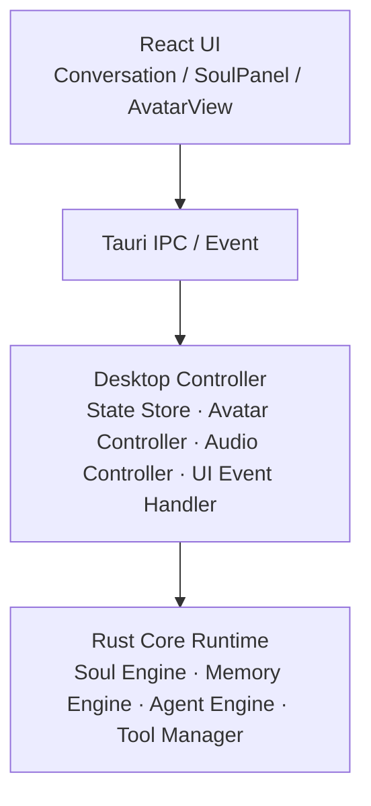

# FURINA Desktop UI Design Spec v1.0

> **冻结声明**：本文是 Furina Desktop（GUI v2）的**长期冻结设计文档**。冻结范围包括
> 分层架构、状态所有权、状态协议（JSON Schema）、事件协议、Avatar 抽象接口、
> 情绪投影、主题 Token、布局信息架构与工程边界（Non-Goals）。文中标为
> 「默认/预留」的内容不属于冻结约束，可在后续版本演进。
>
> - 冻结版本：v1.0（schema_version 起始 = `"1.0"`）；v1.1（2026-08-07，Non-Goals 更新为 3D 路线）
> - 冻结日期：2026-08-07（重制版，继承 2026-08-07 早前规划的全部决策）
> - 状态：设计冻结（作为 GUI v2 实现的唯一设计依据）
> - 技术栈：UI 层 **React + Vite**；Rust Core / Tauri 沿用现有架构

---

## 1. 定位与目标

Furina Desktop 是 Furina Personal AI Lifeform 的桌面表现层。v1（现有实现）是
「顶栏 + 聊天 + 输入」的单栏窗口；v2 升级为**沉浸式布局**：Avatar 舞台 + 对话工作区 +
灵魂状态面板 + 运行状态条。本 spec 冻结协议与接口，为 3D Avatar、复杂动画、
多显示器与桌面化能力保留扩展空间。

本文只定义**架构约束**，不绑定具体实现细节（像素、颜色、动画参数值等均不冻结）。

---

## 2. Desktop 分层架构

### 2.1 总体架构图



### 2.2 职责边界

| 层 | 职责 | 禁止 |
| --- | --- | --- |
| React UI | 展示、交互输入、状态渲染；把用户意图转成事件/命令 | 直接读写 Soul State；自行推导业务状态 |
| Tauri IPC / Event | 命令（invoke）与事件（listen/emit）的传输通道 | 承载业务逻辑 |
| Desktop Controller | 状态聚合（Workspace + Memory 摘要）、Avatar 表达式/意图投影、音频控制、UI 事件分发 | 修改核心人格状态；做安全/权限判断 |
| Rust Core Runtime | 唯一业务真相源：人格、记忆、Agent 状态机、工具执行、权限审批 | 直接渲染 UI |

### 2.3 设计原则

- **Rust Core Runtime 是唯一业务真相源**：所有会改变人格/记忆/关系的状态只存在于 Core。
- **Desktop Layer 只负责展示、交互、状态转换**：不做业务决策。
- **GUI 不直接修改 Soul State**：任何用户交互只产生事件/命令，是否改变人格状态由
  Rust Core 决定。
- **Desktop Controller 是隔离层**：UI 不知道 Core 内部结构，Core 不知道 UI 细节。

---

## 3. 状态所有权（State Ownership）

| 状态 | Owner | 备注 |
| --- | --- | --- |
| EmotionState（六维） | Soul Engine | 唯一可写者 |
| Relationship（关系阶段/信任） | Soul Engine | 唯一可写者 |
| Memory Count / Memory Store | Memory Engine | GUI 只见数量摘要 |
| Tool Status（工具执行/审批） | Agent / Tool Manager | 状态机产出 |
| Avatar Expression / Intent | Desktop Controller | 由 Soul State 投影，可写但不得反向 |
| Workspace 上下文 | Desktop Controller 聚合 | 来源：AppState（root/ws）+ Soul（memory_scope） |

**核心约束：GUI 永远不能直接修改 Soul State。**

禁止的反模式：

- UI 按钮直接修改「开心/生气」等情绪值；
- 用户绕过人格逻辑直接控制情绪；
- Avatar 表现反向影响 Soul State（例如渲染层把表情写回情绪）。

所有用户交互 → 事件/命令 → Rust Core 决定 → 状态变化 → 通过协议推送回 UI。

---

## 4. 状态协议 JSON

### 4.1 通用规则

- 所有状态 JSON 必须带 `schema_version` 与 `timestamp`（Unix 毫秒）。
- 协议保持**轻量化**：只传展示所需的最小数据，不传记忆正文、日志、base64 音频等。
- 字段升级走[版本迁移表](#44-版本迁移表)，不破坏旧客户端。

### 4.2 soul_state

```json
{
  "schema_version": "1.0",
  "timestamp": 1783324800000,
  "workspace": {
    "root": "D:\\project\\Furina_Agent",
    "current_ws": "D:\\project\\Furina_Agent",
    "memory_scope": "workspace_furina_agent",
    "active_memory_count": 65
  },
  "mood": "proud",
  "mood_label": "得意",
  "intensity": 0.8,
  "stage": {
    "id": "acquaintance",
    "label": "认识",
    "trust": 16.0,
    "hint": "你们开始熟悉彼此"
  },
  "emotions": {
    "confidence": 97.0,
    "trust": 16.0,
    "attachment": 17.0,
    "energy": 93.0,
    "stress": 23.0,
    "pride": 96.0
  },
  "memory_count": 65,
  "last_intent": {
    "intent": "praise_response",
    "cause": "user_praise",
    "value": null
  },
  "agent_status": {
    "state": "idle",
    "action": null,
    "detail": null
  },
  "interaction_count": 142
}
```

字段来源标注：

| 字段 | 来源 |
| --- | --- |
| `schema_version` / `timestamp` | Desktop Controller（协议层） |
| `workspace.root` / `workspace.current_ws` | AppState（Desktop 根目录 / 可选 workspace 覆盖） |
| `workspace.memory_scope` | Desktop Controller 由 root 派生（`workspace_<名>`） |
| `workspace.active_memory_count` | Memory Engine（摘要，不含记忆内容） |
| `mood` / `mood_label` | Soul Engine `Soul::mood()` |
| `intensity` | Desktop Controller 投影（见 §6） |
| `stage` | Soul Engine `Soul::stage()` |
| `emotions` | Soul Engine `EmotionState` |
| `memory_count` | Memory Engine |
| `last_intent` | Soul Engine `Soul.last_intent` |
| `agent_status` | Agent / Tool Manager 状态机 |
| `interaction_count` | Soul Engine `RelationshipState.interaction_count` |

### 4.3 avatar_expression 与 avatar_intent

```json
{
  "schema_version": "1.0",
  "timestamp": 1783324800000,
  "mood": "proud",
  "intensity": 0.8,
  "valence": 0.42,
  "arousal": 0.58,
  "speaking": true,
  "audio_level": 0.35,
  "voice": {
    "speaking": true,
    "voice_id": "furina_default",
    "phoneme": "",
    "start_time": 0,
    "duration": 0
  }
}
```

`voice` 字段预留音素驱动口型（phoneme/start_time/duration）；当前实现只用
`speaking` 与 `audio_level`（见 §7）。

```json
{
  "schema_version": "1.0",
  "timestamp": 1783324800000,
  "intent": "confident_idle",
  "intensity": 0.8,
  "pose_hint": "upward"
}
```

`avatar_intent` 初始词表：`confident_idle` / `teasing` / `comforting` / `thinking` /
`listening` / `refused`。不同渲染器把 intent 自由映射到具体动画；意图词表是
**协议的一部分**，可随版本扩展。

### 4.4 版本迁移表

| schema_version | 变更 | 迁移动作 |
| --- | --- | --- |
| 1.0 | 初始冻结 | — |
| 1.1（示例） | `stage.trust` 演进为 `stage.relationship_score` | 旧客户端忽略新字段；新客户端回退读取 `trust` |

规则：字段重命名/删除必须新增版本并保留兼容读取路径；未知字段忽略。

---

## 5. 统一 Event Envelope

所有**新协议事件**统一封装：

```json
{
  "event_id": "a1b2c3d4-0000-4000-8000-000000000000",
  "event_type": "furina-soul-state",
  "timestamp": 1783324800000,
  "payload": {}
}
```

### 5.1 首批事件

| event_type | payload | 触发 |
| --- | --- | --- |
| `furina-soul-state` | 完整 `soul_state` | 状态变化（节流 ~500ms）；初始化与 `Done` 后拉取 |
| `furina-avatar-expression` | `avatar_expression` | 心情/口型/语速变化时 |

### 5.2 预留事件

`furina-memory-created`、`furina-task-complete`、`furina-emotion-change`、
`furina-voice-start`、`furina-voice-end`——均使用同一 Envelope 格式。

### 5.3 兼容规则

- 现有 `furina-event`（核心结构化事件，含 `Event::Interjection`）与
  `furina-approval`（审批弹窗）**不迁移**，保持原样。
- 新事件一律走 Envelope；禁止新增裸事件。
- `furina-soul-state` 采用「事件 push（节流）+ 命令 pull（初始化/`Done`）」混合，
  避免高频轮询。

---

## 6. Emotion Projection Function v1

### 6.1 归属

情绪投影（Emotion Projection Function）属于 **Desktop / Avatar Adapter Layer**：
把 Soul Engine 产生的**真实人格状态**启发式投影为 Avatar 可理解的连续参数。
它**不是**人格模型本身，不允许放在 Soul Engine Core。

未来新增人格维度（如 curiosity / loneliness / excitement）时，只需升级投影函数，
不需要改动 Soul Engine 架构。

### 6.2 约束

- 纯函数：`project(emotions, mood, cfg) -> { valence, arousal, intensity }`；
- 输出范围 0–1；
- 不修改 Soul State（只读输入）；
- Avatar Renderer 不参与计算（只消费结果）。

### 6.3 v1 定义

```text
valence   = (pride + confidence + trust + attachment − stress) / 400   // clamp 0..1
arousal   = (energy + stress) / 200                                    // clamp 0..1
intensity = 心情对应维度偏离基线的归一化幅度                              // clamp 0..1
```

说明：trust / attachment 属于正向关系激活因素，归入 valence；不归入 arousal
（生理唤醒维度由 energy / stress 驱动）。六维取值范围 0–100。

---

## 7. Voice Synchronization Protocol

当前实现只支持基础口型（`speaking` + `audio_level`）。协议为未来 3D Avatar 的
音素驱动 / 高级口型预留：

```json
{
  "speaking": true,
  "voice_id": "furina_default",
  "phoneme": "",
  "start_time": 0,
  "duration": 0
}
```

- `speaking`：是否正在朗读（前端播放状态驱动）。
- `audio_level`：当前音量电平（0–1，来自 audio 元素），驱动口型开合幅度。
- `voice_id`：当前音色标识。
- `phoneme` / `start_time` / `duration`：预留；未来支持音素级口型、表情同步、语音动画。

约束：口型/语音同步只属于展示层消费，不参与任何技术判断；`audio_level` 由前端
播放状态计算，后端不生产。

---

## 8. 情绪映射与主题 Token

### 8.1 MoodKind × 强度默认映射（Placeholder 基准）

强度档位：低（intensity < 0.34）/ 中（0.34–0.67）/ 高（> 0.67）。

| MoodKind | 低 | 中 | 高 | 默认姿态（pose_hint） |
| --- | --- | --- | --- | --- |
| calm 淡定 | 平静呼吸 | 从容 | 悠然 | `steady` |
| happy 开心 | 微笑 | 眉眼弯弯 | 笑开、肢体舒展 | `open` |
| proud 得意 | 微扬下巴 | 昂首 | 昂首挺胸 | `upward` |
| hurt 委屈 | 垂眼 | 低头 | 缩肩 | `downward` |
| sad 难过 | 眼神放空 | 低头 | 微蜷 | `withdrawn` |
| annoyed 恼火 | 抿嘴 | 皱眉 | 别过脸 | `turned_away` |

> 这是 PlaceholderAdapter 的**默认基准**；VRM 及未来适配器可自由重新映射。

### 8.2 主题 Token（颜色不冻结）

情绪颜色属于 **Theme Layer**，映射只给 Token 名，不绑定具体 RGB：

| Token | 默认心情映射 |
| --- | --- |
| `emotion_neutral` | calm |
| `emotion_warm` | happy |
| `emotion_gold` | proud |
| `emotion_cold` | hurt |
| `emotion_dim` | sad |
| `emotion_heat` | annoyed |

具体色值由主题（深色/浅色/皮肤/Avatar）决定；Soul Layer 不产生颜色。

---

## 9. Workspace 与 Approval 展示规范

### 9.1 Workspace Context（SoulPanel 常驻）

SoulPanel 必须展示 Workspace Isolation 信息，避免"普通聊天机器人"体验：

```text
Current Workspace: D:\project\furina\Furina_Desktop
Memory Scope:      workspace_furina_agent
Active Memories:   65
```

数据来源：`workspace.*`（见 §4.2），GUI 只读聚合结果，不接收记忆正文。

### 9.2 Agent 行为状态 / 审批状态

GUI 必须展示 Agent 当前行为状态与审批流转：

```text
Furina wants to: DELETE file /path/test.txt
Status: Waiting Approval        [Approved | Waiting | Rejected | Blocked]
```

- 状态枚举：`Approved` / `Waiting` / `Rejected` / `Blocked`（危险模式拦截等）。
- 审批弹窗沿用现有交互；新增状态徽章与流转展示。
- 状态来源：`agent_status`（Agent / Tool Manager 状态机），GUI 不自行判断权限。

---

## 10. 布局冻结规则（信息架构优先）

### 10.1 冻结：四个区域的职责

| 区域 | 职责 |
| --- | --- |
| Avatar Stage | 角色展示（表情/动作/口型）；右侧留白为 2D/3D 模型视口预留 |
| Conversation Workspace | 聊天、记忆、工具输出展示 |
| Soul Status | 人格状态展示（心情/情绪/关系/Workspace 上下文） |
| Runtime Status | 核心运行状态展示（Soul / Memory / Agent / Tool Manager） |

### 10.2 不冻结：像素排列

- 1280×800 是**默认窗口**而非强制布局；最小 960×640。
- 4K / 宽屏 / 可调整窗口允许左右、上下、浮动面板等任意排列，只要四个区域职责不变。
- 原则：**冻结信息架构，不冻结 UI 排列方式**。

### 10.3 默认信息架构（参考，不冻结）

```text
┌──────────────────────────────────────┐
│              Avatar Stage            │  ← 角色展示（右留白=2D/3D 预留）
├──────────────────────┬───────────────┤
│ Conversation Workspace│  Soul Status │
│ （聊天/记忆/工具输出）  │ （情绪/关系/  │
│                      │  Workspace）  │
├──────────────────────┴───────────────┤
│         Runtime Status（四引擎）       │
└──────────────────────────────────────┘
```

---

## 11. 技术栈与迁移约束

- **UI 层**：React + Vite 构建链（Node 依赖引入）；组件边界对应 §2.1（Conversation /
  SoulPanel / AvatarView）。
- **Tauri**：`tauri.conf.json` 的 `frontendDist` 指向 React 构建产物
  （`desktop/ui/dist`）；`withGlobalTauri` 与 capabilities（`core:default`）沿用。
- **构建流程**：`npm install` → `npm run build`（产物 `dist/`）→ `cargo run -p
  furina-desktop`；开发期可用 Vite dev server + `devUrl`。
- **Rust Core**：不因 UI 重构改动；只新增协议所需的命令/事件发射点（如 `soul_state`
  完整字段、Envelope 事件），且实现轮单独评审。

---

## 12. Non-Goals v1.0（工程边界）

以下内容**不是未来禁止实现**，而是明确 FURINA Desktop UI v1.0 的工程边界：

1. **Live2D 与 3D/VRM 渲染**：本轮均不实现；Avatar 走 3D 长期路线（见
   FURINA_3D_AVATAR_ROADMAP.md），协议保持实现无关。
2. **VRM / 3D 模型渲染实现**：仍不实现模型加载、骨骼系统、IK、动作系统
   （路线图是规划，Non-Goals 是本轮工程边界）。
3. **自主修改 Soul State**：任何 Avatar / UI 行为不得直接修改 EmotionState、
   Relationship、Memory；所有人格变化必须由 Rust Core Runtime 决定。
4. **多 Agent 系统**：本版本只设计单 Furina Runtime。
5. **云端人格同步**：本地优先；不设计云端人格存储、多设备同步。
6. **社交系统**：不实现用户社区、好友系统、分享人格。
7. **完整桌宠生态**：不实现开机启动管理、系统级桌面覆盖、多平台插件。

---

## 13. 验收清单（spec 文档级）

### 完整性

- [ ] 分层架构、状态所有权、协议 JSON、Event Envelope、Avatar 接口、情绪投影、
      主题 Token、Workspace 展示、Approval 展示、Non-Goals 各有独立章节；
- [ ] 情绪映射表覆盖全部 6 个 MoodKind；
- [ ] `soul_state` / Envelope 每个字段标注来源（Soul / AppState / Controller 推导）。

### 一致性

- [ ] 三层架构、状态所有权表、协议字段三处无冲突；
- [ ] 「GUI 永不写 Soul State」贯穿交互流程、状态所有权表与 Non-Goals；
- [ ] Non-Goals 与「预留 Avatar Provider 接口」不矛盾（接口兼容 ≠ 本轮实现）。

### 可落地性

- [ ] PlaceholderAdapter 仅凭本 spec 即可实现，无未决策项；
- [ ] React + Vite 迁移路径明确（frontendDist、组件边界、协议不变）；
- [ ] 状态协议不含记忆正文（轻量化）；
- [ ] 布局章节同时给出默认信息架构图与「不冻结排列」声明。

---

## 14. 冻结清单（快速索引）

1. Desktop 分层架构（§2）
2. 状态所有权（§3）
3. JSON Schema Version（§4.1）
4. Event Protocol（§5）
5. Avatar 抽象接口（§4.3、§6）
6. Voice 扩展预留（§7）
7. Emotion Mapping（§6、§8）
8. Workspace 展示规范（§9.1）
9. Approval UI 规范（§9.2）
10. Theme Token 规范（§8.2）

本 spec 自冻结之日起作为 GUI v2 实现的唯一设计依据；任何变更走版本迁移表。
